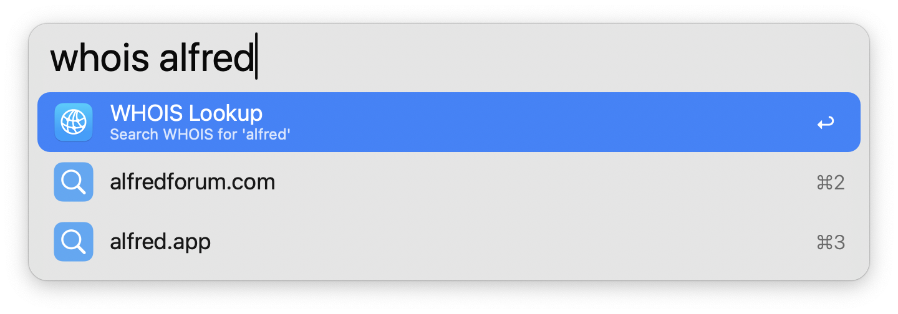

#  WHOIS Lookup

Perform a WHOIS lookup in Alfred

[⤓ Install from the Alfred Gallery](https://alfred.app/workflows/firefingers21/whois-lookup/)

## Usage

Perform a [WHOIS](https://en.wikipedia.org/wiki/WHOIS) lookup via the `whois` keyword. Type the domain, IP address, or IP range you would like to query.

* <kbd>↩</kbd> View WHOIS data in Alfred's [Text View](https://www.alfredapp.com/help/workflows/user-interface/text/).
* <kbd>⌘</kbd><kbd>↩</kbd> View raw WHOIS data in a text file.

Autocomplete previous lookups by pressing tab or selecting from the search suggestions. By default, the first suggestion will be tab-completed.

When viewing a WHOIS response, the [Text View](https://www.alfredapp.com/help/workflows/user-interface/text/) can selectively summarize key information before showing the raw data, configurable from the [Workflow's Configuration](https://www.alfredapp.com/help/workflows/user-configuration/).

* <kbd>⌥</kbd><kbd>↩</kbd> Refresh WHOIS data (Lookups are cached for 6 hours).
* <kbd>⌘</kbd><kbd>↩</kbd> Open raw WHOIS data in a text file.

Configure the [Hotkey](https://www.alfredapp.com/help/workflows/triggers/hotkey/) as a shortcut to perform a WHOIS lookup. Use the [Universal Action](https://www.alfredapp.com/help/features/universal-actions/) to query URLs from Alfred’s [Clipboard History](https://www.alfredapp.com/help/features/clipboard/) or selected text.

