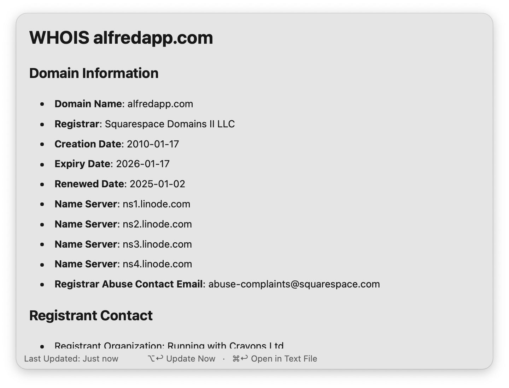

#  WHOIS Lookup

Perform a WHOIS lookup in Alfred

## Usage

Perform a [WHOIS](https://en.wikipedia.org/wiki/WHOIS) lookup using the `whois` keyword. Type the domain or IP address you would like to query.

* <kbd>↩</kbd> View WHOIS data in Alfred's [Text View](https://www.alfredapp.com/help/workflows/user-interface/text/)
* <kbd>⌘</kbd><kbd>↩</kbd> View raw WHOIS data in a text file

The [Text View](https://www.alfredapp.com/help/workflows/user-interface/text/) will try to summarize important information at the top, then display the raw, unmodified data at the bottom. You can choose which information you'd like summarized in the [Workflow’s Configuration](https://www.alfredapp.com/help/workflows/user-configuration/).

Configure the [Hotkey](https://www.alfredapp.com/help/workflows/triggers/hotkey/) as a shortcut to perform a WHOIS lookup. Use the [Universal Action](https://www.alfredapp.com/help/features/universal-actions/) to query URLs from Alfred’s [Clipboard History](https://www.alfredapp.com/help/features/clipboard/) or selected text.

